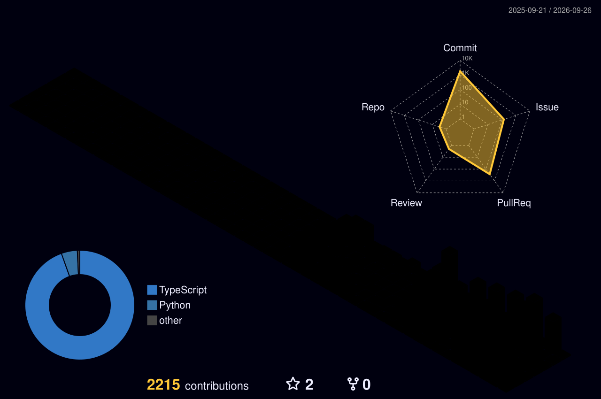

<h1 align="center">Hi, I'm Shogo 👋</h1>

  Computer Science / Cognitive Science 
  Interested in LLMs, NLP, Human-AI Interaction, and Developer Tools.

  Student at Shizuoka University, Japan.

I build tools around AI-assisted software development and study how people establish shared understanding through dialogue.

### Currently

- 🎓 Researching grounding and representational misalignment in dialogue
- 🧠 Interested in LLMs, NLP, Cognitive Science, and Human-AI Interaction
- 🛠️ Building StudyPlanner — an AI-assisted study planning application
- 🔧 Exploring multi-agent development workflows and AI coding tools

### GitHub Activity

<picture>
  <source media="(prefers-color-scheme: dark)" srcset="https://raw.githubusercontent.com/kame447/kame447/output/github-snake-dark.svg">
  <source media="(prefers-color-scheme: light)" srcset="https://raw.githubusercontent.com/kame447/kame447/output/github-snake.svg">
  
</picture>

